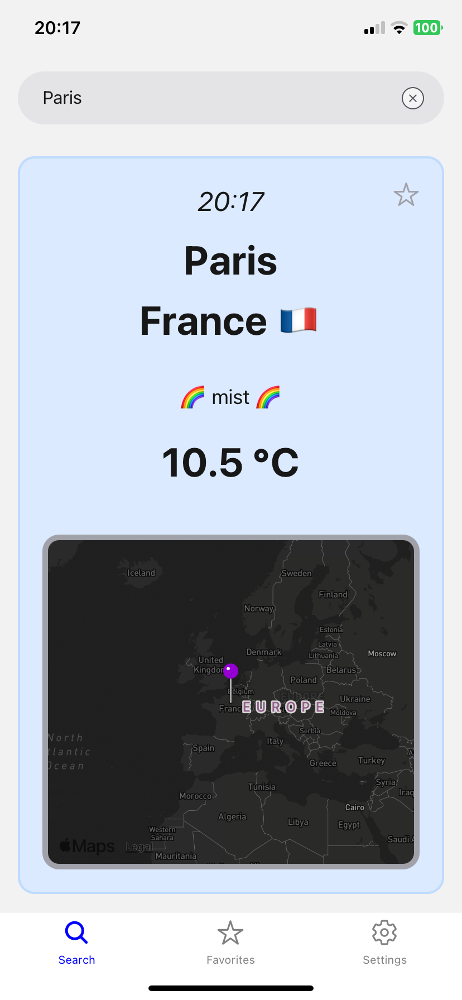
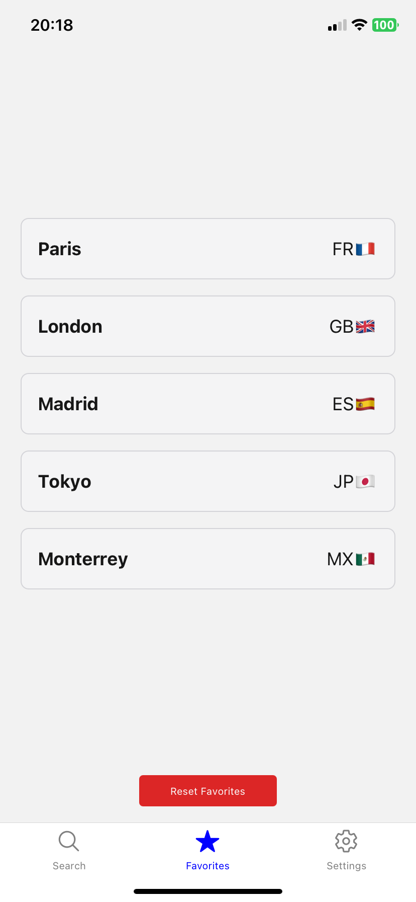
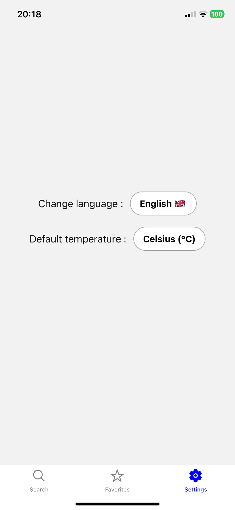

# 🌦️ Prometeos

## 📋 Description

**Prometeos** is a cross-platform mobile application developed with **Expo** and **React Native** that allows users to search and view current weather conditions for various cities. It includes features like adding cities to favorites, changing the temperature unit (Celsius/Fahrenheit), automatic switching between light and dark map modes based on the time, and multilingual support.

## ✨ Features

- 🔍 **City search** with automatic suggestions.
- 🌡️ **Display current weather conditions** for a city: temperature, local time, sky condition with emojis.
- ⭐ **Add cities to favorites** for quick access.
- 🔄 **Change temperature unit** between Celsius and Fahrenheit.
- 🌍 **Multilingual support** (French, English, Spanish).
- 📌 **View favorites** with city names automatically translated according to the selected language.
- 🗺️ **Dynamic maps**: switch between light and dark mode based on the time of day.

## 📂 Project Structure

- `App.js` : 🏠 Entry point of the application with tab navigation configuration (Search, Favorites, Settings) and global context.
- `FavoritesContext.js` : ⭐ Context to manage favorites (add, remove, reset).
- `TemperatureContext.js` : 🌡️ Context to manage the default temperature unit (Celsius or Fahrenheit).
- `components/` : Contains the main components of the application.
  - `WeatherManager.js` : 🌦️ Manages search, city validation, and weather data display.
  - `FavoritesPage.js` : 📄 Displays favorite cities and allows navigation to their weather forecast.
  - `CityInput.js` : ✏️ Input component with suggestions for city search.
  - `WeatherDisplay.js` : ☁️ Displays weather data, local time, and a button to add/remove favorites.
  - `CityMap.js` : 🗺️ Displays a map centered on the selected city.

## 🌐 Multilingual Configuration

Localization is managed with **i18next**, and translations are stored in JSON files. City and country names are translated using API calls and the `i18n-iso-countries` library.

## 📸 Screenshots

  
  
  

## 👥 Contributors

- **Maxime Rollin** - Lead Developer
